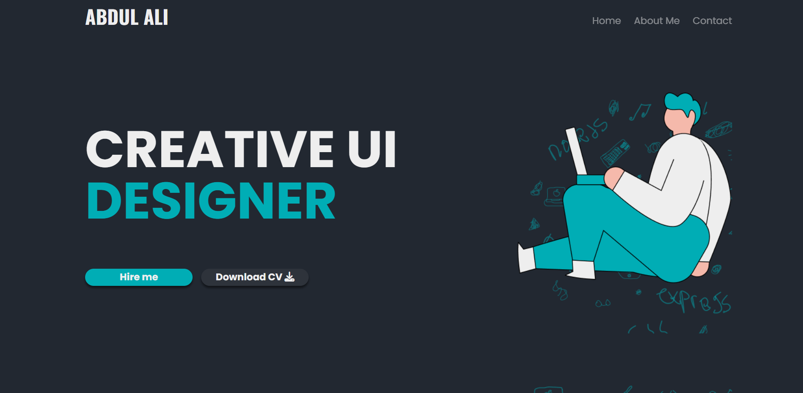

# Abdul Ali - Personal Portfolio Website

## 🚀 Live Demo

[Link to the live website](https://shah541-g.github.io/Portfolio-Layout/)

## 📸 Screenshot



---

## About The Project

This is a single-page personal portfolio website for Abdul Ali, a Creative UI Designer. The website is designed to showcase Abdul's skills, display recent work, and provide an easy way for potential clients or employers to get in touch. The clean and modern interface is fully responsive and emphasizes a strong visual hierarchy, making it suitable for presenting a professional online presence.

---

## Features

- **Responsive Design**: The website adapts seamlessly to all device sizes, from mobile phones to large desktop screens.
- **Header & Navigation**: A fixed header displays the developer's name and includes navigation links for Home, About Me, and Contact sections.
- **Hero Section**: The introductory section features a bold headline ("Creative ui designer") with prominent call-to-action buttons for "Hire me" and "Download CV".
- **About Me Section**: Provides a personal summary alongside an illustrative image to introduce Abdul Ali.
- **Recent Works Section**: A project gallery with filter categories (All, UI, UX, Web Design) to highlight recent work.
- **Contact Form**: Includes fields for name, email, and message, making it easy for visitors to reach out.
- **Footer**: Contains quick navigation links, social media icons, and legal information (Terms of Service, Privacy Policy).

---

## Tech Stack

- **HTML5**: Provides the semantic structure and content of the website.
- **CSS3**: Handles the styling, layout, and ensures responsiveness across devices.
- **Google Fonts**: Utilizes 'Poppins' for body text and 'Oswald' for the name/logo to achieve a modern typographic look.
- **Font Awesome**: Supplies scalable vector icons used throughout the site (e.g., download, share, navigation).
- **Images & Assets**: Custom imagery and icons located in the `assets/` folder.

---

## Project File Structure

```
your-project-folder/
├── assets/
│   ├── home.png
│   ├── about-me.png
│   ├── contact.png
│   ├── Course Website Landing Page Thumbnail 1.png
│   ├── Group 33.png
│   ├── Group 1.png
│   ├── home-img-bg.png
│   ├── about-me__bg.png
│   ├── works-about-bg.png
│   ├── facebook.png
│   ├── instagram.png
│   ├── twitter.png
│   └── youtube.png
├── index.html
└── style.css
```

---

## Getting Started

### Prerequisites

- No special tools are required—just a modern web browser (e.g., Chrome, Firefox, Edge).

### Installation

1. **Clone the repository or download the ZIP file:**
   ```sh
   git clone https://github.com/shah541-g/Portfolio-Layout/
   ```

2.  **Open the `index.html` file in your web browser.**

---

## Code Explanation

### Layout & Responsiveness

- The CSS uses a **mobile-first approach**: base styles target mobile devices by default.
- **@media queries** at 900px, 980px, 1100px, and 1340px progressively enhance the layout for tablets and desktops.
- **Flexbox** (via the `.row` and `.flex` classes) aligns items horizontally or vertically, ensuring a flexible and responsive layout.
- Containers use percentage-based widths (`width: 80%`) and auto margins for consistent centering.

### Styling & Theming

- The site uses a **dark theme** with a background color of `#222831`, off-white text (`#EEEEEE`), and a vibrant accent (`rgba(0, 173, 181, 1)`) for highlights and buttons.
- The `.jelly-blue` class is consistently applied for accent text and elements.
- **Buttons** (`.hire-btn`, `.cv-btn`) have pill shapes, shadows, and hover effects for interactivity.

### Component-Based Styling

- CSS classes are organized to match logical components:
  - `.cta`, `.hire-btn`, `.nav-list`, `.about-me__heading`, etc.
- This modular approach makes the code easier to maintain and extend.

### Typography

- **Google Fonts**: 'Poppins' is used for general text, giving a clean, modern appearance, while 'Oswald' is reserved for the developer’s name/logo, lending a distinct character.
- Font sizes, weights, and spacing are defined to create a clear visual hierarchy and improve readability.

---

## Customization Guide

Follow these steps to tailor the template for your own portfolio:

1. **Change Personal Information**
   - **Name**: Edit the text inside the `<span class="my-name">` tag in `index.html`.
   - **Headline**: Update the `<h1 class="home__heading">` tag for your title or role.
   - **About Me Text**: Modify the `<p class="about-me__paragraph">` with your personal bio.

2. **Update Images**
   - Replace placeholder images in the `./assets/` folder (`home.png`, `about-me.png`, `contact.png`, etc.) with your own images using the same file names, or update the `src` attributes in `index.html` as needed.

3. **Add Your Projects**
   - In the "My recent works" section (`.variants` div), update the `` tags to showcase your own projects and thumbnails.

4. **Modify Color Scheme**
   - All color values are defined at the top of `style.css` or in reusable classes like `.jelly-blue`.
   - Adjust these color codes to match your personal branding preferences.

5. **Update Social Links**
   - In the footer, replace the anchor tags’ `href` attributes with links to your own social media profiles.

---

Want to make this template your own? Fork the repository, follow the customization steps above, and showcase your creativity!

---
